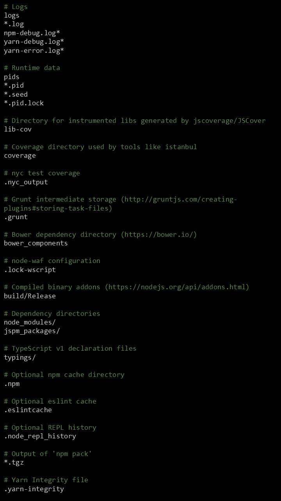

<p align="center">
  
</p>

<center>

[Create a New Board](https://corkboard2018.herokuapp.com)

[Live Boot Camp Resource Board](https://corkboard2018.herokuapp.com/boards/a0cfcbfb-aa24-42cf-a6b5-553e138e0b58#)
</center>

# Table of Contents: 

* [About Our Product](#Product)
* [Product Description](#Description)
* [How to Install](#Installation)
* [Usage](#Usage)
* [Contributing](#Contributing)
* [Credits](#Credits)
* [License](#License)

<center>

## <a name="Product"></a>About Our Product</center>

#### Purpose
Cork Board is an easy to use dynamic web application that allows you to create and bookmark a unique board space and invite anyone to read and post to your board. On your board, you can bookmark, tag, and search for your favorite links. You can also add announcements to communicate with your board followers.

It's our hope that through our app you can better pool resources with teammates, friends, and classmates as you work together. The Cork Board app allows a team/group/class to have a bulletin board site to share messages and resource links.


<center>

## <a name="Description"></a>Product Description</center>

Cork Board allow users to create a project board for announcements and bookmarks to helpful articles/websites, bookmarks will have a description, url, and topic.

On hitting the home page for the app, users will be able to create a project board. Then they will get a url back that is a link to their new project page. On the project page any user that has that url will be able to add messages or resources to the board.

The board will also have a search function, that will allow users to show resources by tag/topic. So if a user clicks or asks for "dogs", they will get every resource that has a topic of "dogs".

After board creation, Cork Board asks for users to invite by email, then after entering email addresses, app sends invitation email to users


<center>

## <a name="Installation"></a>How to Install </center>

The following are instructions for downloading this GitHub repository in order to duplicate this site application.  

1. First clone this GitHub repository to your local folder. 

<p align="center">

</p>
 

2. After cloning this GitHub reposirtory on your local folder where you plan to install the application.  Then run ```npm i``` to implement all the required   dependency package files.  


#### Implemented  Packages

* Body-Paser
* Metatag-Crawler
* 
* 
* 
* 
* 
* 
* 


#### Create a .gitnore 

> Create the .gitnore file and post the following code:




#### Create a .env 

> Create a .env file and post the code below to store the e-mail and password settings for sending e-mail.


<center>

## <a name="Usage"></a>Usage</center>


<center>

## <a name="Contributing"></a>Contributing</center>


<center>

## <a name="Credits"></a>Credits</center>

* "Reinaldo Llano"<reinaldo@projectcodex.biz> - Application Team Leader and Front End Developer
* "Lee Warrick" <lee@projectcodex.biz> - Application Co-Team Leader and Full Stack Developer
* "Jon Disla" <jon@projectcodex.biz> - Full Stack Developer
* "Hisham Galeb" <Hisham.nman@gmail.com> - Front End Developer
* "Syyad Khan" <syyadkhan@yahoo.com> - Front End Developer

<center>

## <a name="License"></a>License</center>

>   [MIT](https://github.com/mynar7/corkboard/blob/master/LICENSE)
